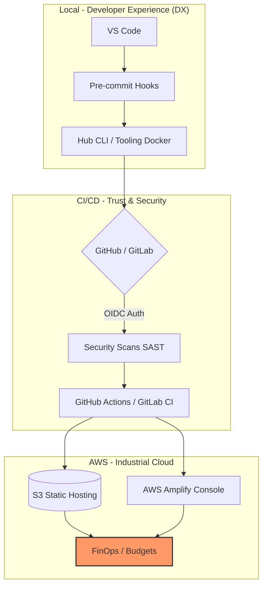

# 👨‍💼 Guía para Reclutadores / Empresas

Este repositorio es un **ecosistema de ingeniería** diseñado para demostrar madurez técnica, seguridad y una visión clara del ciclo de vida del software (SDLC).

## 🧭 Visión General de la Arquitectura

## 🌟 Valor Diferencial

1. **Seguridad Anticipada (Shift Left):** Auditoría de secretos y dependencias desde el entorno local, no solo en la nube.
2. **Infraestructura como Código (IaC):** Flujos de trabajo que eliminan la configuración manual ("ClickOps"), garantizando reproducibilidad.
3. **Control de Costos (FinOps):** Arquitecturas Serverless diseñadas para escalar a bajo costo con monitoreo de presupuestos.
4. **DX (Developer Experience):** Herramientas (Hub CLI) que reducen el tiempo de onboarding y estandarizan la calidad del código en todo el equipo.

## 🛠️ Evidencias Técnicas

- **Despliegue Multi-branch:** Ver [AWS_PASO_A_PASO.md](../aws-amplify-mi-sitio-1/AWS_PASO_A_PASO.md) en la carpeta de Amplify.
- **Ecosistema de Validación:** Ver [TOOLING.md](TOOLING.md) para entender la capa de abstracción en Docker.
- **Políticas de Calidad:** Ver [killed.md](killed.md) para conocer las prácticas de ingeniería que rechazo y por qué.

---
*Este proyecto demuestra mi capacidad para transformar requisitos de negocio en arquitecturas resilientes, seguras y económicamente viables.*
