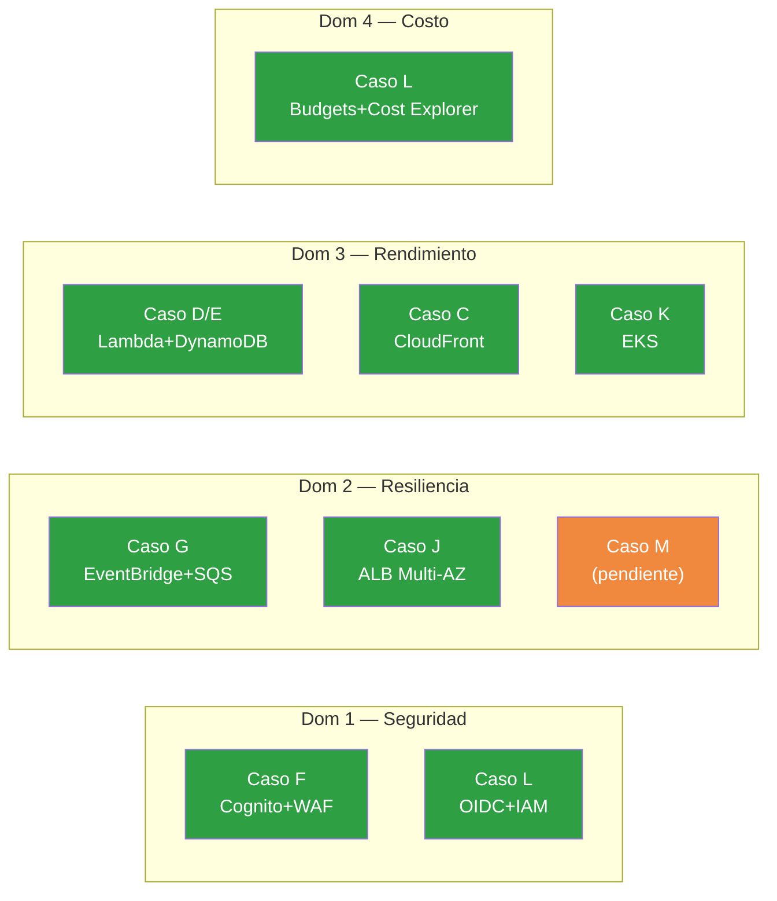

# ☁️ Certificacion AWS SAA-C03 — Solutions Architect Associate

> **Cobertura actual del repositorio:** 80%
> **Costo del examen:** ~$300 USD
> **Duracion del examen:** 130 minutos, 65 preguntas (opcion multiple y multiple respuesta)
> **Validez:** 3 años
> **Recomendacion:** Es la certificacion mas cercana con el estado actual. Prioridad alta.

---

## Que evalua este examen

La SAA-C03 mide la capacidad de disenar soluciones AWS que sean seguras, resilientes, de alto rendimiento y optimizadas en costo. No evalua comandos de memoria — evalua criterio de arquitectura.

---

## Dominios y cobertura por caso

### Dominio 1 — Disenar arquitecturas seguras (30% del examen)

| Tema requerido | Cubierto por | Estado |
|---|---|---|
| IAM roles, politicas, least privilege | Caso L (OIDC + roles) | ✅ |
| Cognito User Pools y federacion de identidad | Caso F | ✅ |
| WAF y proteccion de APIs | Caso F | ✅ |
| KMS y cifrado en reposo/transito | Caso L (S3 con SSE) | ✅ parcial |
| Security Groups y NACLs | Caso J y K (VPC + Fargate) | ✅ |
| Secrets Manager vs Parameter Store | No cubierto directamente | ⚠️ estudiar |
| AWS Shield | Mencionado en F, no implementado | ⚠️ conceptual |

**Cobertura del dominio: 75%**

---

### Dominio 2 — Disenar arquitecturas resilientes (26% del examen)

| Tema requerido | Cubierto por | Estado |
|---|---|---|
| Multi-AZ con ALB y ECS | Caso J (ALB + Fargate) | ✅ |
| Auto Scaling Groups | Caso J (ECS Service scaling) | ✅ parcial |
| Route 53 Failover y health checks | Caso M (Fase 0 — pendiente) | 🔄 |
| Multi-Region con latency routing | Caso M Fase 2 (proyectado) | ⏳ |
| RDS Multi-AZ y Read Replicas | No cubierto (repo usa DynamoDB) | ❌ estudiar |
| S3 versionado y replicacion | Caso B y C (S3) | ✅ parcial |
| DLQ y reintentos en colas | Caso G (SQS + DLQ) | ✅ |
| EventBridge y desacoplamiento | Caso G | ✅ |

**Cobertura del dominio: 55%**
**Gap critico:** Route 53 failover real (Caso M) y RDS resiliencia (no aplica en este repo — estudiar por separado).

---

### Dominio 3 — Disenar arquitecturas de alto rendimiento (24% del examen)

| Tema requerido | Cubierto por | Estado |
|---|---|---|
| Lambda con API Gateway (REST y HTTP) | Casos D, E, F, G, H | ✅ |
| DynamoDB Single Table Design y GSI | Caso E | ✅ |
| CloudFront como CDN | Caso C | ✅ |
| ElastiCache (Redis/Memcached) | No cubierto | ❌ estudiar |
| ECS Fargate con ALB | Caso J | ✅ |
| EKS y Kubernetes | Caso K | ✅ |
| SQS y SNS para desacoplamiento | Caso G | ✅ |
| S3 Transfer Acceleration | No cubierto | ❌ conceptual |

**Cobertura del dominio: 70%**
**Gap:** ElastiCache no esta en ningun caso — estudiar para el examen.

---

### Dominio 4 — Disenar arquitecturas optimizadas en costo (20% del examen)

| Tema requerido | Cubierto por | Estado |
|---|---|---|
| Savings Plans y Reserved Instances | Caso L (FINOPS_MANUAL) | ✅ conceptual |
| Spot Instances para workloads tolerantes | No implementado | ⚠️ conceptual |
| S3 Intelligent Tiering y lifecycle | Caso B, C | ✅ parcial |
| Lambda vs EC2 vs Fargate — analisis de costo | docs/FINOPS_COSTOS.md | ✅ |
| Presupuestos y alertas con AWS Budgets | Caso L | ✅ |
| Cost Explorer y etiquetado | Caso L | ✅ |
| Right-sizing con Compute Optimizer | No cubierto | ⚠️ estudiar |

**Cobertura del dominio: 65%**

---

## Resumen visual de cobertura

```
Dominio 1 — Seguridad (30%):         ███████░░░  75%
Dominio 2 — Resiliencia (26%):        █████░░░░░  55%
Dominio 3 — Alto rendimiento (24%):   ███████░░░  70%
Dominio 4 — Costo optimizado (20%):   ██████░░░░  65%

COBERTURA TOTAL ESTIMADA:             ████████░░  80%
```

---

## Temas criticos que NO cubre este repositorio

Estos temas aparecen con frecuencia en el examen y requieren estudio adicional fuera del repo:

| Tema | Frecuencia en examen | Recurso sugerido |
|---|---|---|
| RDS Multi-AZ, Read Replicas, Aurora | Alta | AWS Skill Builder — RDS labs |
| ElastiCache Redis (patron cache-aside) | Media | Documentacion AWS + whitepaper |
| Route 53 avanzado (latency, geolocation, weighted) | Alta | Caso M cuando se complete |
| EC2 Auto Scaling Groups con lifecycle hooks | Media | Labs gratuitos AWS |
| Spot Instances y Spot Fleet | Media | Conceptual en docs |
| AWS Organizations y SCPs | Media | Caso L cubre Budgets, no SCPs |
| Transit Gateway y VPC Peering | Baja-Media | Arquitectura de red avanzada |
| Secrets Manager rotacion automatica | Media | Agregar a Caso F (mejora futura) |

---

## Que es el simulacro y donde hacerlo

El **simulacro** es un examen de practica — no es AWS oficial. Son proveedores externos que venden bancos de preguntas construidos para imitar el estilo y dificultad del examen real. Se hacen en formato cronometrado (65 preguntas en 130 minutos) y al terminar muestran cada respuesta con explicacion detallada.

**Proveedores recomendados:**

| Proveedor | Formato | Costo aprox. | Por que usarlo |
|---|---|---|---|
| **Tutorials Dojo — Jon Bonso** | Practice exams online | $15-20 USD | El mas cercano al examen real en estilo y dificultad. Muy detallado en explicaciones. |
| **Stephane Maarek (Udemy)** | Curso + practice exams | $15-25 USD (con oferta) | Curso completo + preguntas. Ideal si aun faltan conceptos teoricos. |

**Estrategia:** sacar 80%+ en 3 simulacros distintos antes de agendar el examen real. El examen real cuesta $300 — los $20 del simulacro son la mejor inversion.

---

## Plan de estudio recomendado

```
Semana 1-2:  Repasar los 11 casos del repo — architecture.md de cada uno
Semana 3:    Completar Caso M Fase 1 (Route 53 + failover real)
Semana 4:    RDS: leer AWS docs + hacer 1 lab en Free Tier (db.t3.micro)
Semana 5:    ElastiCache: whitepaper + preguntas de practica
Semana 6:    Simulacro 1 completo (Tutorials Dojo — 65 preguntas, 130 min)
             → Repasar todos los errores con las explicaciones
Semana 7:    Simulacro 2 y 3 hasta sacar 80%+ consistente
Semana 8:    Agendar y rendir el examen
```

---

## Relacion con los casos del repositorio



---

*Ultima revision: marzo 2026 — basado en guia oficial SAA-C03 de AWS Training and Certification*
