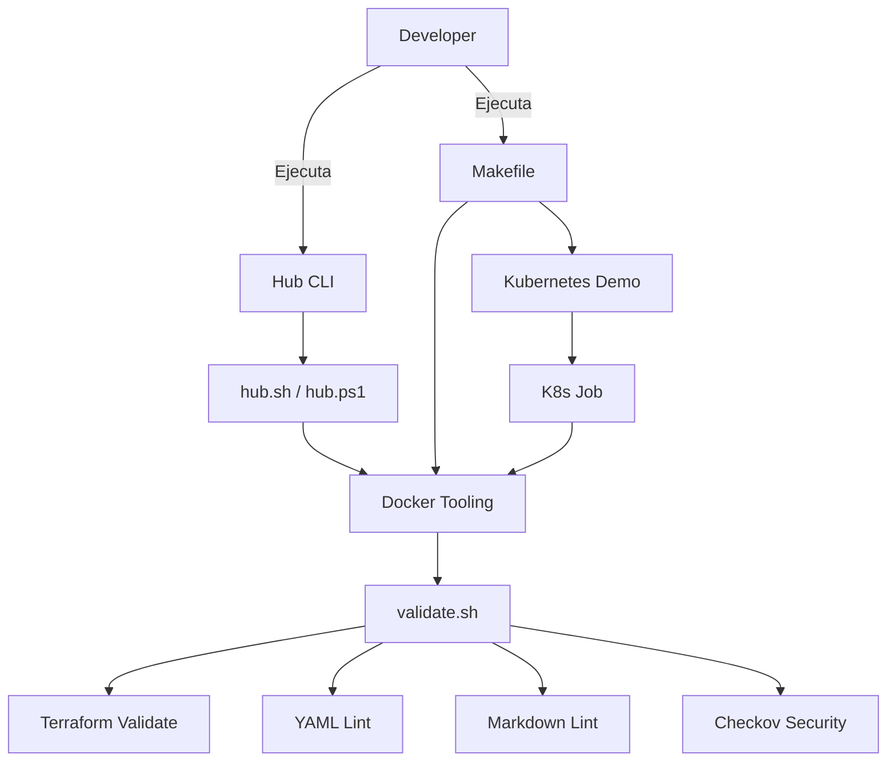

# 🛠️ Guía de Tooling - proyectos-aws

Documentación completa del sistema de tooling con Docker, Kubernetes y validaciones automatizadas.

---

## 📋 Tabla de Contenidos

- [Arquitectura](#arquitectura)
- [Componentes](#componentes)
- [Comandos Disponibles](#comandos-disponibles)
- [Smoke Tests](#smoke-tests)
- [Troubleshooting](#troubleshooting)

---

## Arquitectura

El sistema de tooling proporciona una capa de validación y automatización **completamente opcional** que no afecta el funcionamiento de los proyectos existentes.



### Principios de Diseño

1. **Opcional:** Los proyectos legacy funcionan sin tooling
2. **Sin credenciales:** Todo funciona sin AWS keys
3. **Seguro:** Usuario no-root, SecurityContext, NetworkPolicy
4. **Portable:** Funciona en Windows (PowerShell) y Linux/Mac (bash)

---

## Componentes

### 1. Docker Tooling Image

**Ubicación:** `tooling/Dockerfile.tooling`

**Herramientas incluidas:**

- AWS CLI v2 (2.15.10)
- Terraform (1.7.0)
- Checkov (3.1.50) - Security scanning
- yamllint (1.33.0)
- markdownlint-cli (0.39.0)

**Características de seguridad:**

- ✅ Usuario no-root (`tooling:1000`)
- ✅ Tags fijos (no `latest`)
- ✅ Healthcheck incluido
- ✅ Imagen base Alpine (mínima)

**Build:**

```bash
make tooling-build
```

---

### 2. Validation Script

**Ubicación:** `tooling/scripts/validate.sh`

**Validaciones ejecutadas:**

| Validación | Herramienta | Descripción |
| :--- | :--- | :--- |
| Terraform Format | `terraform fmt -check` | Verifica formato de archivos .tf |
| Terraform Validate | `terraform validate` | Valida sintaxis y configuración |
| YAML Lint | `yamllint` | Valida sintaxis YAML |
| Markdown Lint | `markdownlint` | Valida formato Markdown |
| Security Scan | `checkov` | Escanea IaC por problemas de seguridad |

**Códigos de salida:**

- `0`: Todas las validaciones pasaron
- `1`: Al menos una validación falló

---

### 3. Makefile

**Ubicación:** `Makefile` (raíz del proyecto)

**Comandos principales:**

```bash
make help                  # Muestra ayuda
make tooling-build         # Construye imagen Docker
make tooling-validate      # Ejecuta validaciones
make tooling-shell         # Shell interactivo
make security-scan         # Escaneo de secretos
make k8s-demo             # Demo en Kubernetes
make k8s-clean            # Limpia recursos K8s
```

---

### 4. Hub CLI

**Scripts:**

- `hub.sh` (Linux/Mac)
- `hub.ps1` (Windows PowerShell)

**Comandos:**

```bash
# Linux/Mac
./hub.sh list-projects     # Lista proyectos aws-*
./hub.sh validate          # Ejecuta validaciones
./hub.sh help              # Muestra ayuda

# Windows PowerShell
.\hub.ps1 list-projects
.\hub.ps1 validate
.\hub.ps1 help
```

---

### 5. Kubernetes Demo

**Ubicación:** `k8s/tooling-job/`

**Recursos:**

- `namespace.yaml`: Namespace `tooling-demo`
- `job.yaml`: Job que ejecuta validaciones
- `networkpolicy.yaml`: NetworkPolicy restrictiva
- `kustomization.yaml`: Configuración Kustomize

**Características de seguridad:**

```yaml
securityContext:
  runAsNonRoot: true
  runAsUser: 1000
  readOnlyRootFilesystem: true
  allowPrivilegeEscalation: false
  capabilities:
    drop: [ALL]

resources:
  limits:
    memory: "512Mi"
    cpu: "500m"
```

---

## Comandos Disponibles

### Desarrollo Local

```bash
# 1. Construir imagen de tooling
make tooling-build

# 2. Ejecutar validaciones
make tooling-validate

# 3. Shell interactivo para debugging
make tooling-shell

# 4. Listar proyectos
./hub.sh list-projects      # Linux/Mac
.\hub.ps1 list-projects     # Windows

# 5. Escaneo de seguridad
make security-scan
```

### Kubernetes (Demo)

```bash
# 1. Crear cluster kind (si no existe)
kind create cluster --name proyectos-aws

# 2. Desplegar job de validación
make k8s-demo

# 3. Ver logs del job
kubectl logs -n tooling-demo -l job-name=tooling-validate

# 4. Ver estado del job
kubectl get jobs -n tooling-demo

# 5. Limpiar recursos
make k8s-clean

# 6. Eliminar cluster (opcional)
make k8s-delete-cluster
```

---

## Smoke Tests

### Test 1: Build de Imagen Docker

**Objetivo:** Verificar que la imagen se construye correctamente

```bash
make tooling-build
```

**Resultado esperado:**

```text
✅ Imagen construida: proyectos-aws/tooling:1.0.0
```

**Verificación:**

```bash
docker images | grep proyectos-aws/tooling
```

---

### Test 2: Validación Local

**Objetivo:** Ejecutar validaciones en el repositorio

```bash
make tooling-validate
```

**Resultado esperado:**

```text
🔍 Iniciando validación de tooling
==========================================

📋 Validando archivos Terraform...
✓ Terraform format check

📋 Validando archivos YAML...
✓ YAML lint check

📋 Validando archivos Markdown...
✓ Markdown lint check

✅ Validación EXITOSA
```

---

### Test 3: Hub CLI - List Projects

**Objetivo:** Verificar que el Hub CLI lista proyectos correctamente

```bash
# Linux/Mac
./hub.sh list-projects

# Windows
.\hub.ps1 list-projects
```

**Resultado esperado:**

```text
📂 Proyectos AWS encontrados:

  ▸ aws-amplify-mi-sitio-1 (XX archivos)
  ▸ aws-s3-scrum-mi-sitio-1 (XX archivos)

✅ Total: 2 proyecto(s)
```

---

### Test 4: Hub CLI - Validate

**Objetivo:** Ejecutar validaciones vía Hub CLI

```bash
# Linux/Mac
./hub.sh validate

# Windows
.\hub.ps1 validate
```

**Resultado esperado:**

- Construye imagen si no existe
- Ejecuta `make tooling-validate`
- Muestra resultados de validación

---

### Test 5: Security Scan (Pre-commit)

**Objetivo:** Verificar detección de secretos

```bash
# Instalar pre-commit
pip install pre-commit
pre-commit install

# Ejecutar todos los hooks
pre-commit run --all-files
```

**Resultado esperado:**

```text
detect-secrets...........................................................Passed
check-yaml...............................................................Passed
check-json...............................................................Passed
check-merge-conflict.....................................................Passed
end-of-file-fixer........................................................Passed
trailing-whitespace......................................................Passed
```

---

### Test 6: Kubernetes Demo (kind)

**Objetivo:** Desplegar y ejecutar job en Kubernetes

**Prerequisitos:**

```bash
# Instalar kind (si no está instalado)
# Linux/Mac:
curl -Lo ./kind https://kind.sigs.k8s.io/dl/v0.20.0/kind-linux-amd64
chmod +x ./kind
sudo mv ./kind /usr/local/bin/kind

# Windows (PowerShell):
choco install kind
```

**Ejecución:**

```bash
# 1. Desplegar demo
make k8s-demo

# 2. Verificar job
kubectl get jobs -n tooling-demo

# 3. Ver logs
kubectl logs -n tooling-demo -l job-name=tooling-validate

# 4. Verificar SecurityContext
kubectl get job -n tooling-demo tooling-validate -o yaml | grep -A 10 securityContext

# 5. Verificar NetworkPolicy
kubectl get networkpolicy -n tooling-demo
```

**Resultado esperado:**

```text
NAME               COMPLETIONS   DURATION   AGE
tooling-validate   1/1           30s        1m
```

---

### Test 7: Docker Security Verification

**Objetivo:** Verificar que el contenedor NO corre como root

```bash
docker run --rm proyectos-aws/tooling:1.0.0 whoami
```

**Resultado esperado:**

```text
tooling
```

**NO debe retornar:** `root`

---

### Test 8: Intentar Commit con Secret (Debe Fallar)

**Objetivo:** Verificar que pre-commit bloquea secretos

```bash
# Crear archivo con secret de prueba
echo "AWS_SECRET_ACCESS_KEY=wJalrXUtnFEMI/K7M-EJEMPLO-KEY-NO-REAL" > test-secret.txt

# Intentar commit
git add test-secret.txt
git commit -m "test secret detection"
```

**Resultado esperado:**

```text
detect-secrets...........................................................Failed
- hook id: detect-secrets
- exit code: 1

ERROR: Potential secrets detected!
```

**Limpieza:**

```bash
git reset HEAD test-secret.txt
rm test-secret.txt
```

---

## Troubleshooting

### Problema: Docker no está corriendo

**Síntoma:**

```text
❌ Error: Docker no está corriendo
```

**Solución:**

```bash
# Linux
sudo systemctl start docker

# Mac
# Abrir Docker Desktop

# Windows
# Abrir Docker Desktop
```

---

### Problema: Imagen de tooling no encontrada

**Síntoma:**

```text
⚠️  Imagen de tooling no encontrada
```

**Solución:**

```bash
make tooling-build
```

---

### Problema: kind no instalado

**Síntoma:**

```text
⚠️  kind no instalado
```

**Solución:**

```bash
# Linux/Mac
curl -Lo ./kind https://kind.sigs.k8s.io/dl/v0.20.0/kind-linux-amd64
chmod +x ./kind
sudo mv ./kind /usr/local/bin/kind

# Windows (Chocolatey)
choco install kind

# Windows (Scoop)
scoop install kind
```

---

### Problema: Pre-commit hooks no se ejecutan

**Síntoma:**

Los commits se realizan sin ejecutar validaciones

**Solución:**

```bash
# Instalar pre-commit
pip install pre-commit

# Instalar hooks en el repositorio
pre-commit install

# Verificar instalación
pre-commit run --all-files
```

---

### Problema: Terraform validate falla

**Síntoma:**

```text
✗ Terraform validate: /workspace/some-dir
```

**Solución:**

```bash
# Inicializar Terraform en el directorio
cd some-dir
terraform init -backend=false

# Volver a ejecutar validación
make tooling-validate
```

---

### Problema: Permisos en hub.sh (Linux/Mac)

**Síntoma:**

```text
bash: ./hub.sh: Permission denied
```

**Solución:**

```bash
chmod +x hub.sh
./hub.sh help
```

---

## 📚 Referencias

- [Docker Best Practices](https://docs.docker.com/develop/dev-best-practices/)
- [Kubernetes Security Context](https://kubernetes.io/docs/tasks/configure-pod-container/security-context/)
- [Terraform Validation](https://developer.hashicorp.com/terraform/cli/commands/validate)
- [Pre-commit Framework](https://pre-commit.com/)
- [Checkov Documentation](https://www.checkov.io/1.Welcome/What%20is%20Checkov.html)

---

## 🤝 Contribuciones

Para contribuir al tooling:

1. Asegurar que pre-commit hooks están instalados
2. Ejecutar `make tooling-validate` antes de commit
3. Verificar que los tests pasan
4. Actualizar documentación si es necesario

---

**Última actualización:** 2026-02-04  
**Versión:** 1.0.0
